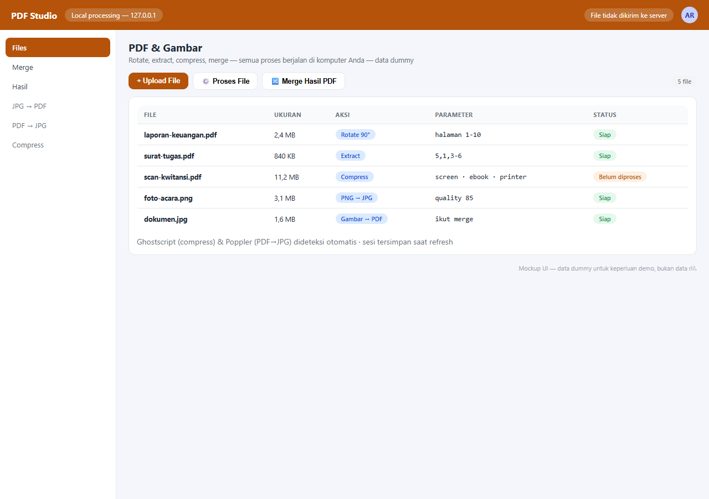

# PDF Studio

[](https://github.com/adityarahmanananda-dev/pdf-web-tool/actions/workflows/ci.yml)

A local web app for manipulating and merging PDF files, plus image conversion. Everything runs on your own computer — files are never sent to any server.

Features consolidated from several earlier Python scripts: `jpg_to_pdf`, `pdf_to_jpg`, `png_to_jpg`, `pdf_tool_gui`, `pdf_tools`, `pdf_compressor`.

## Screenshot



> Screenshot is a UI mockup with dummy data — not real data.

## Features

- **Upload multiple files at once** — PDF and images (JPG/PNG/BMP/TIFF/WEBP), drag & drop or file picker.
- **Per-file actions**, multiple at the same time:
  - 🔃 **Rotate** — rotate specific pages (90/180/270°, CW/CCW)
  - ✂ **Extract** — take specific pages in any order (e.g. `5,1,3-6`)
  - 🗜 **Compress** — reduce PDF size (screen/ebook/printer/prepress quality via Ghostscript)
  - 🖼 **PDF → JPG** — each page becomes a JPG, output zipped
  - 📄 **Image → PDF** — images become PDF (can be included in a merge)
  - 🖼 **PNG → JPG** — convert PNG (transparency becomes white)
- **Arrange** — reorder files with drag-and-drop, or sort by name A→Z / Z→A.
- **Merge** — combine processed PDFs and/or originals in row order (images are converted first).
- **Review results** — after processing, a result summary appears first; then you can download files individually or all at once (ZIP).
- **Session persist** — uploaded files are kept by the local server; the list survives a page refresh.

## Requirements

- Python 3.9+
- pip packages: `flask`, `pikepdf`, `pillow`, `img2pdf`
- System tools:
  - `poppler-utils` (for PDF → JPG, provides `pdftoppm`)
  - `ghostscript` (for compression, provides `gs`)

## Installation & running

```bash
# 1. install Python dependencies
pip install flask pikepdf pillow img2pdf

# 2. install system tools
#   Debian/Ubuntu:
sudo apt install poppler-utils ghostscript
#   macOS:
brew install poppler ghostscript
#   Windows: install from https://www.ghostscript.com/download.html
#   and https://github.com/oschwartz10612/poppler-windows

# 3. run
cd pdf-web-tool
python3 app.py
```

Then open **http://127.0.0.1:5001** in your browser.

Optional: for development with auto-reload, run `python3 app.py --debug`.

## Project-local Ghostscript (no system install)

If you don't want to install Ghostscript system-wide, you can put the `gs` binary inside the project:

1. Download a Ghostscript build for Linux, e.g. the conda-forge `ghostscript` package.
2. Extract it and place the binary at `vendor/ghostscript/bin/gs`.
3. The app automatically uses the local binary; if absent, it falls back to `gs` on the system PATH.

The `vendor/` folder is git-ignored (the binaries are large), so fill it in manually per machine.

## Usage

1. Upload files (PDF/images) — several at once.
2. On each file row, tick the actions you want and set their parameters.
3. Click **⚙️ Process Files**.
4. Review the results in the **Process Result** modal, then download per item or **⬇ Download All (ZIP)**.
5. To merge, arrange the file order (drag) then click **🔀 Merge Result PDF**.

### Input page formats

- `1-3,5,7-9` → pages 1 to 3, 5, 7 to 9
- `5,1,3` → output follows the written order
- `5-1` → reverse (5,4,3,2,1)
- Empty on Rotate = all pages

## Project structure

```
pdf-web-tool/
├── app.py              # Flask backend + PDF logic
├── templates/
│   └── index.html      # main page
├── static/
│   ├── app.js          # frontend logic
│   └── style.css
├── storage/            # uploads & results (git-ignored)
└── vendor/             # optional local ghostscript (git-ignored)
```